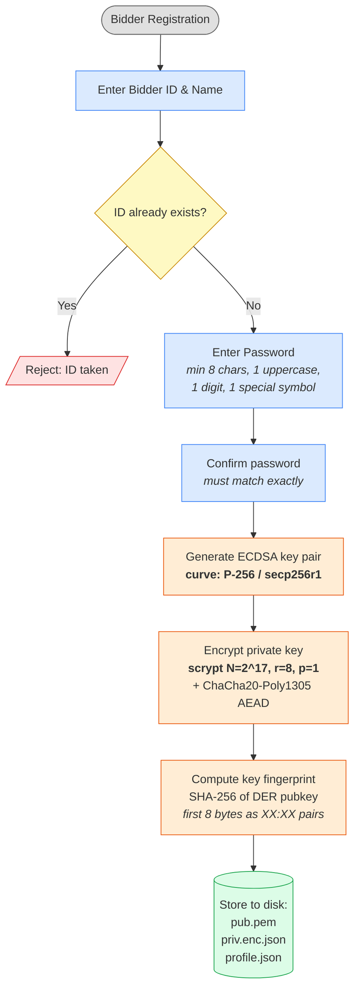
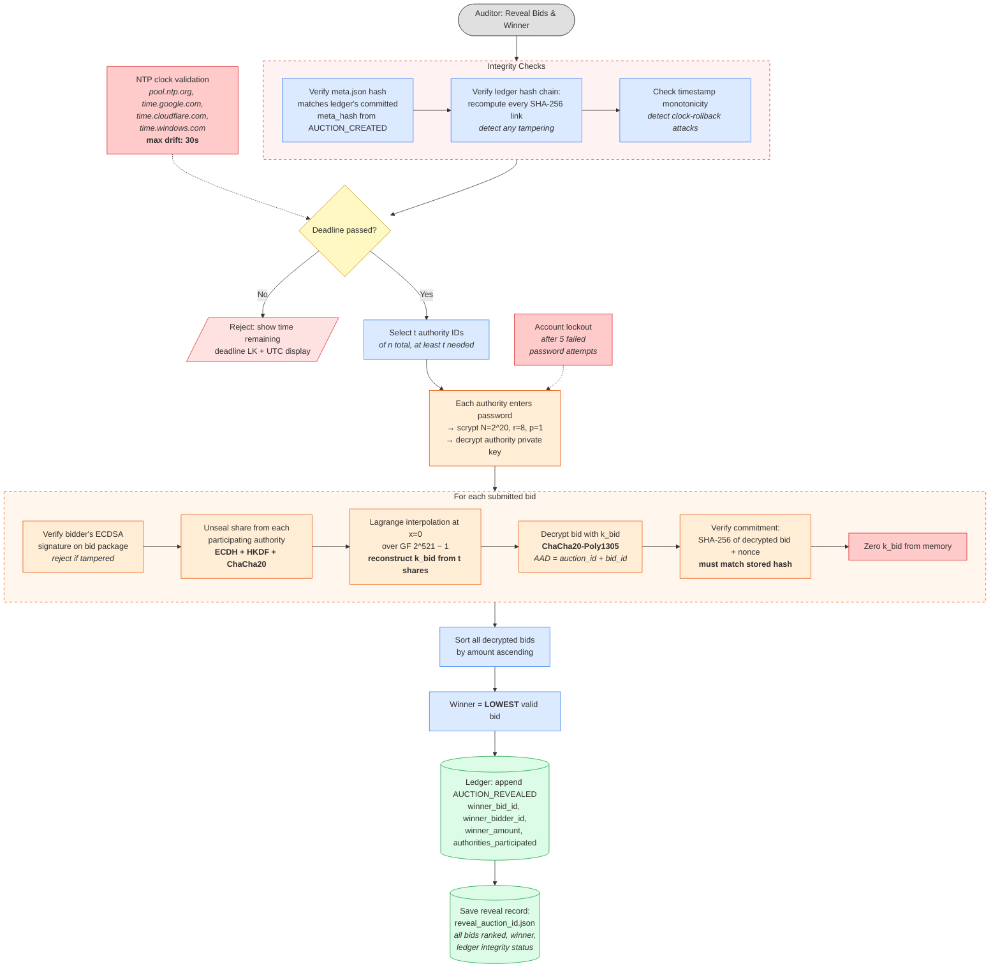

# Sealed-Bid Auction System — Setup Phase

## Bidder Registration

**Storage location:** `store/users/bidders/{bidder_id}/`

| File | Contents |
|------|----------|
| `pub.pem` | ECDSA public key (PEM, SubjectPublicKeyInfo) |
| `priv.enc.json` | Encrypted private key (salt, nonce, ciphertext, scrypt params) |
| `profile.json` | Bidder ID, name, pubkey PEM, fingerprint, creation timestamp |

---

## Auction Creation

```mermaid
flowchart TD
    A_START([Auction Creation])
    A_NAME[Set auction name]
    A_DEADLINE[Set deadline<br/><i>Formats: '2026-03-15 14:30:00' LK local<br/>'2026-03-15T09:00:00Z' UTC<br/>'in 30 minutes / in 2 hours'</i>]
    A_LIMITS[Set bid limits<br/><i>min and max amounts, both optional</i>]
    A_TN[Set threshold: t-of-n authorities<br/><b>t ≥ 2, n ≥ 2, t ≤ n</b>]
    A_LOOP[For each authority i = 1..n:<br/>set authority ID & password<br/><i>IDs must be unique</i>]
    A_KEYGEN[Generate ECDSA key pair<br/>per authority<br/><b>curve: P-256</b>]
    A_ENC[Encrypt each authority priv key<br/><b>scrypt N=2^20, r=8, p=1</b><br/>≈1s — higher cost for high-value keys<br/>+ ChaCha20-Poly1305 AEAD]
    A_PUBSTORE[(Store per authority:<br/>pub.pem + priv.enc.json)]
    A_META[Build meta.json:<br/>auction_id, name, deadline_utc,<br/>t, n, authority_ids,<br/>authority_pubkeys_pem,<br/>crypto algorithm identifiers]
    A_HASH[Compute meta_hash<br/><b>SHA-256 of canonical JSON</b><br/><i>sorted keys, no whitespace</i>]
    A_LEDGER[(Ledger: append<br/>AUCTION_CREATED event<br/>with meta_hash committed)]
    A_SAVE[(Save meta.json to disk<br/><i>includes meta_hash field</i>)]

    A_START --> A_NAME
    A_NAME --> A_DEADLINE
    A_DEADLINE --> A_LIMITS
    A_LIMITS --> A_TN
    A_TN --> A_LOOP
    A_LOOP --> A_KEYGEN
    A_KEYGEN --> A_ENC
    A_ENC --> A_PUBSTORE
    A_PUBSTORE --> A_META
    A_META --> A_HASH
    A_HASH --> A_LEDGER
    A_LEDGER --> A_SAVE

    style A_START fill:#e0e0e0,stroke:#666
    style A_NAME fill:#dbeafe,stroke:#3b82f6
    style A_DEADLINE fill:#dbeafe,stroke:#3b82f6
    style A_LIMITS fill:#dbeafe,stroke:#3b82f6
    style A_TN fill:#dbeafe,stroke:#3b82f6
    style A_LOOP fill:#dbeafe,stroke:#3b82f6
    style A_KEYGEN fill:#ffedd5,stroke:#ea580c
    style A_ENC fill:#ffedd5,stroke:#ea580c
    style A_PUBSTORE fill:#dcfce7,stroke:#16a34a
    style A_META fill:#ffedd5,stroke:#ea580c
    style A_HASH fill:#ffedd5,stroke:#ea580c
    style A_LEDGER fill:#dcfce7,stroke:#16a34a
    style A_SAVE fill:#dcfce7,stroke:#16a34a
```

**Storage location:** `store/auctions/{auction_id}/`

| Path | Contents |
|------|----------|
| `meta.json` | Auction config: deadline, t, n, authority pubkeys, crypto params, meta_hash |
| `ledger.log` | Hash-chained NDJSON audit log (first entry: AUCTION_CREATED) |
| `authorities/{auth_id}/pub.pem` | Authority ECDSA public key |
| `authorities/{auth_id}/priv.enc.json` | Encrypted authority private key |
| `bids/` | Empty directory, populated during bid submission |

**Deadline handling:** All deadlines stored as UTC with Z suffix. Local display uses Asia/Colombo (UTC+05:30). NTP validation at startup checks clock against pool.ntp.org, time.google.com — max allowed drift: 30s.

---

## Legend

| Color | Meaning |
|-------|---------|
| Blue | User input / application logic |
| Orange | Cryptographic operation |
| Green | Data storage / output |
| Yellow | Decision point |
| Gray | Workflow start |

---

# Sealed-Bid Auction System — Bidding & Reveal Phase

## Bid Submission

```mermaid
flowchart TD
    B_START([Bid Submission])
    B_STATE{Auction still open?}
    B_CLOSED[/Reject: deadline passed/]
    B_NTP_CHECK[NTP time validation<br/><i>cross-check against<br/>pool.ntp.org, time.google.com</i>]
    B_AUTH[Authenticate bidder<br/>password → scrypt N=2^17<br/>→ decrypt private key<br/><i>5 attempts before lockout</i>]
    B_DUP{Bidder already<br/>submitted a bid?}
    B_DUP_REJECT[/Reject: one bid<br/>per bidder enforced/]
    B_AMOUNT[Enter bid amount<br/><i>validate against auction's<br/>min_bid / max_bid limits</i>]
    B_KEY[Generate random 32-byte<br/>bid encryption key k_bid<br/><b>os.urandom 32</b>]
    B_ENC[Encrypt bid plaintext<br/>with k_bid using<br/><b>ChaCha20-Poly1305 AEAD</b><br/><i>AAD = auction_id + bid_id</i>]
    B_NONCE[Generate random 32-byte<br/>hidden nonce<br/><b>os.urandom 32</b>]
    B_COMMIT[Compute commitment hash<br/><b>SHA-256 of canonical bid<br/>concatenated with nonce</b><br/><i>binds bid without revealing it</i>]
    B_SHAMIR[Shamir Secret Sharing:<br/>split k_bid into n shares<br/><b>threshold t, field GF 2^521 − 1</b><br/><i>t−1 shares reveal nothing</i>]
    B_SEAL[For each authority:<br/>seal share via ECIES<br/><b>ephemeral ECDH P-256<br/>+ HKDF-SHA256<br/>+ ChaCha20-Poly1305</b>]
    B_ZERO[Zero k_bid from memory<br/><i>bytearray overwrite loop</i>]
    B_SIGN[ECDSA sign entire bid package<br/><b>P-256 + SHA-256</b><br/><i>covers: cipher, sealed shares,<br/>commitment, bidder pubkey</i>]
    B_STORE[(Store encrypted bid package<br/>to bids/bid_id.json)]
    B_LEDGER[(Ledger: append BID_SUBMITTED<br/>bid_id, bidder_id,<br/>commitment_sha256)]
    B_RECEIPT[(Save signed receipt:<br/>bid_id, auction_id,<br/>commitment hash,<br/>ledger tip hash,<br/>timestamp, bidder signature)]

    B_START --> B_STATE
    B_STATE -- No --> B_CLOSED
    B_STATE -- Yes --> B_NTP_CHECK
    B_NTP_CHECK --> B_AUTH
    B_AUTH --> B_DUP
    B_DUP -- Yes --> B_DUP_REJECT
    B_DUP -- No --> B_AMOUNT
    B_AMOUNT --> B_KEY
    B_KEY --> B_ENC
    B_KEY --> B_NONCE
    B_NONCE --> B_COMMIT
    B_ENC --> B_SHAMIR
    B_SHAMIR --> B_SEAL
    B_SEAL --> B_ZERO
    B_ZERO --> B_SIGN
    B_COMMIT --> B_SIGN
    B_SIGN --> B_STORE
    B_SIGN --> B_LEDGER
    B_LEDGER --> B_RECEIPT

    style B_START fill:#e0e0e0,stroke:#666
    style B_STATE fill:#fef9c3,stroke:#ca8a04
    style B_CLOSED fill:#fee2e2,stroke:#dc2626
    style B_NTP_CHECK fill:#fecaca,stroke:#dc2626
    style B_AUTH fill:#dbeafe,stroke:#3b82f6
    style B_DUP fill:#fef9c3,stroke:#ca8a04
    style B_DUP_REJECT fill:#fee2e2,stroke:#dc2626
    style B_AMOUNT fill:#dbeafe,stroke:#3b82f6
    style B_KEY fill:#ffedd5,stroke:#ea580c
    style B_ENC fill:#ffedd5,stroke:#ea580c
    style B_NONCE fill:#ffedd5,stroke:#ea580c
    style B_COMMIT fill:#ffedd5,stroke:#ea580c
    style B_SHAMIR fill:#ffedd5,stroke:#ea580c
    style B_SEAL fill:#ffedd5,stroke:#ea580c
    style B_ZERO fill:#fecaca,stroke:#dc2626
    style B_SIGN fill:#ffedd5,stroke:#ea580c
    style B_STORE fill:#dcfce7,stroke:#16a34a
    style B_LEDGER fill:#dcfce7,stroke:#16a34a
    style B_RECEIPT fill:#dcfce7,stroke:#16a34a
```

---

## Reveal & Determine Winner

**Reveal output:** `reveal_{auction_id}.json` contains all bids ranked lowest-first, winner details, authority participants, ledger integrity status, and timestamps in both UTC and Sri Lanka local time.
